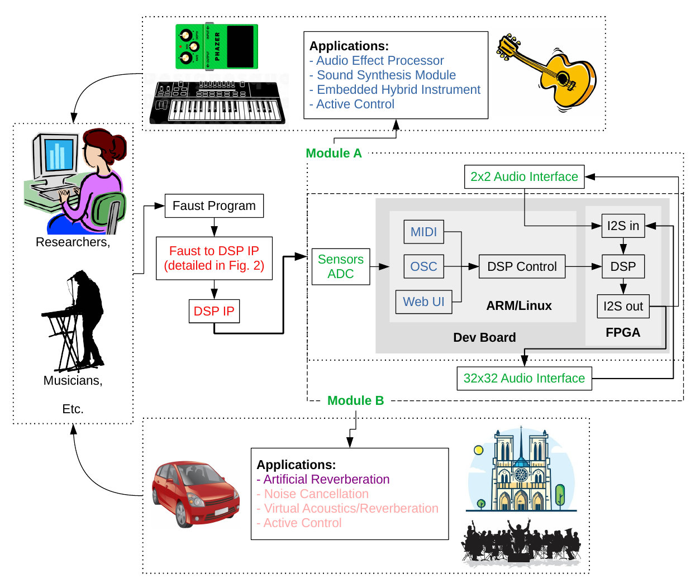
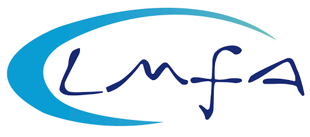

# FAST: Fast Audio Signal-processing Technologies on FPGA

FAST is a research project funded by the [Agence Nationale de la Recherche](https://anr.fr/) (ANR -- the French National Research Agency). It gathers the strength of [GRAME-CNCM](https://www.grame.fr), [CITI Lab (INSA Lyon)](http://www.citi-lab.fr/), and [LMFA (École Centrale Lyon)](http://lmfa.ec-lyon.fr/?lang=en) towards two goals: 

* facilitate the design of ultra-low latency embedded systems for real-time audio signal processing,
* use such systems in the context of active control of acoustics. 

<b>Faust Programming Language -> Audio on FPGA -> Active control of acoustics</b>

## News

### July 2021: First Prototype of the FAST FPGA Audio Processor

<iframe width="800" height="450" src="https://www.youtube.com/embed/acMhZe8V2ls" title="YouTube video player" frameborder="0" allow="accelerometer; autoplay; clipboard-write; encrypted-media; gyroscope; picture-in-picture" allowfullscreen></iframe>

**Read [this article](results/processor.md) for more information.**

## What is FAST?

Embedded systems for audio and multimedia are increasingly used in the arts and culture (e.g., interactive systems, musical instruments, virtual and augmented reality, artistic creation tools, etc.). They are typically based on a CPU (Central Processing Unit) which limits their computational power and induces some latency. FPGAs (Field Programmable Gate Arrays) can be seen as a solution to these problems. However, these types of chips are extremely complex to program, making them largely inaccessible to musicians, digital artists and makers communities. The goal of the FAST project is to enable high-level programming of FPGA-based platforms for multichannel ultra-low-latency audio processing using the Faust programming language (a standard in the field of computer music). We plan to use this system for various applications ranging from sound synthesis and processing to active sound control and artificial sound field/room acoustics.

## Timeline

FAST begun in March 2021 and will last 42 months. 

## Partners

### GRAME-CNCM

GRAME is a "Centre National de Création Musicale" (National Centre for Musical Creation) funded by the French ministry of culture, the Auvergne-Rhône-Alpes region and the city of Lyon. It is organized in three departments: production/music creation, transmission, and research. GRAME's research department hosts four permanent researchers as well as PhD students, postdocs, engineers, interns, etc. Its activities focus on music technology and computer music. GRAME is the birthplace of the [Faust programming language](https://faust.grame.fr) which is used at the heart of FAST.

### CITI Lab @ INSA Lyon

CITI is an academic laboratory associated with [INSA Lyon](https://www.insa-lyon.fr/en/) and [INRIA](https://www.inria.fr/fr). The CITI Laboratory develops research activities bringing together computer science, networking, and digital communications to address the challenging issues related to the development of Internet. One of CITI's research focus is on FPGAs which are heavily used as part of FAST. 

### LMFA @ École Centrale Lyon

The LMFA is the Laboratoire de Mécanique des Fluides et d'Acoustique (Fluid Mechanics and Acoustics Laboratory). It hosts researchers from [École Centrale Lyon](https://www.ec-lyon.fr/), [INSA Lyon](https://www.insa-lyon.fr/en/), [Université Claude Bernard Lyon 1](https://www.univ-lyon1.fr/) and [CNRS](http://www.cnrs.fr/fr). The members of LMFA associated to the FAST project specialize in acoustics active control which is one of the focus of FAST.  

 

