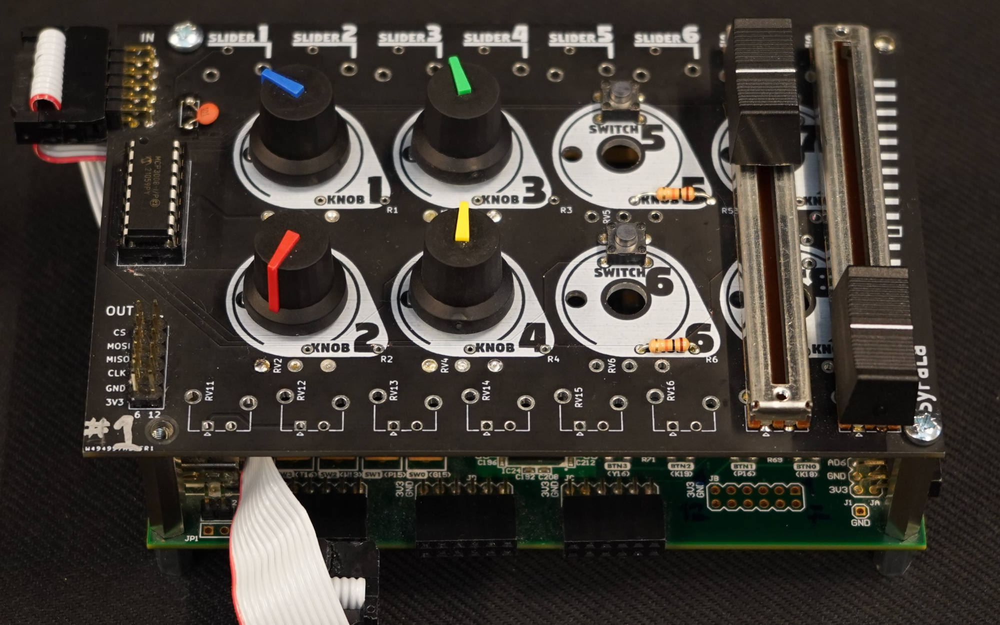
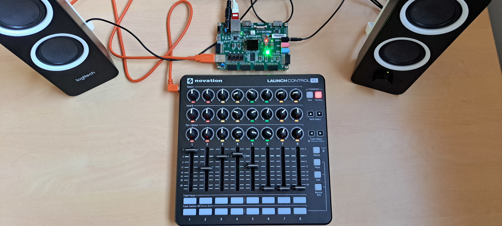
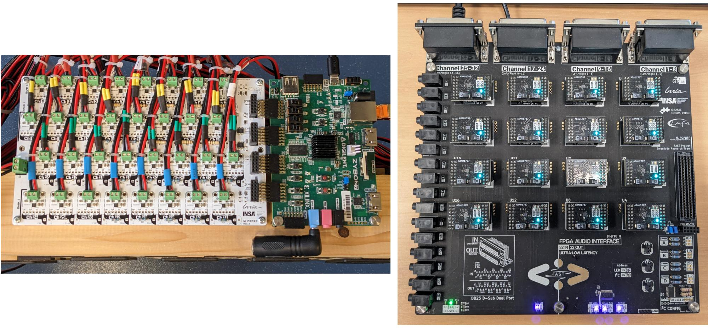
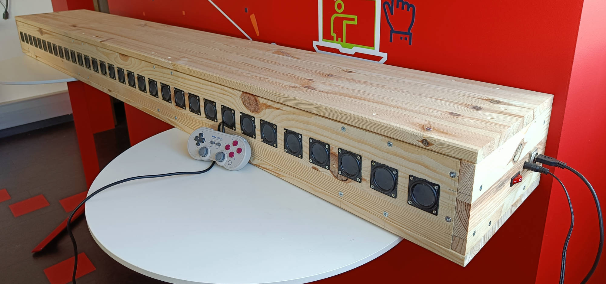
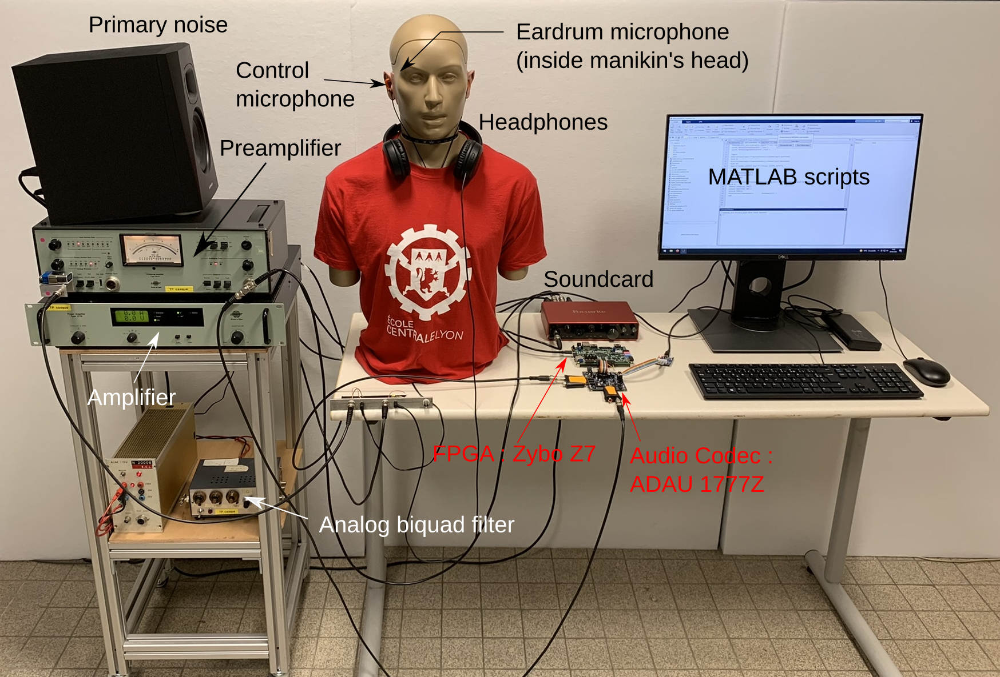

# Practical Results

A large part of the objectives of the FAST project has been achieved. On this page, we attempt to provide an overview of the results obtained.

## Syfala

One of the major contributions of FAST is the Syfala tool (<https://inria-emeraude.github.io/syfala/>), which allows for the programming of AMD/Xilinx FPGAs in C/C++ and Faust for real-time audio signal processing applications, based on the high-level synthesis tools provided by AMD/Xilinx. When Faust is used, the distribution of calculations between the FPGA and the system’s CPU is done automatically. Similarly, memory management (e.g., external DDR memory, internal FPGA memory, etc.) is handled by Syfala. In contrast, when C/C++ is used, these tasks are done manually, which is more complex but also allows for more precise control over program optimization.

In this context, another significant contribution of FAST is a wide range of optimization techniques specific to real-time audio signal processing, based on HLS. These are thoroughly presented in the Syfala documentation. Unfortunately, we did not have time to port this work to Syfala's "Faust mode," which means that it is currently much less efficient than the manual C/C++ mode. In both cases, programming FPGAs for real-time audio signal processing applications is now much simpler thanks to Syfala.

In parallel with this work, a Faust-to-VHDL compiler prototype has been developed. At the moment, it does not offer the same level of performance as the solutions using HLS. In general, a significant amount of pioneering work has been done regarding the management of fixed-point calculations in the Faust compiler. The use of fixed-point arithmetic, both in HLS and VHDL, would increase the performance level of programs produced by Syfala. However, this system is not yet operational.

## Hardware Control

Programs implemented with Syfala can be controlled with a modular hardware interface (see the figure below). This interface can house a wide variety of buttons, rotary or linear potentiometers, etc. The parameters of a Faust or C/C++ program can be easily mapped to physical controllers on this interface, whose use is fully integrated into Syfala.

## Software Control and Embedded Linux Integration

The software part (the one executed on the system's CPU) of a Syfala program can be implemented either as a "bare metal" kernel or as a program running on an embedded Linux provided with Syfala. The bare metal solution allows for handling simple use cases. Specifically, the physical interface mentioned in the previous section uses this method. Similarly, when Faust is used, an option allows for generating a graphical interface executable on a PC connected to the FPGA board. Control data is transmitted to the board via its USB serial port and received by the bare metal kernel.
The embedded Linux approach offers the possibility of using more advanced control methods or receiving digital audio streams via Ethernet. In terms of control, embedded Linux enables, for example, the use of USB MIDI interfaces (see the Figure below) or the Open Sound Control (OSC) protocol. For receiving and sending audio streams over Ethernet, we implemented our own protocol, which is usable via PipeWire. This feature is very useful in applications related to spatialized sound: Wave Field Synthesis systems, Ambisonics, etc.

## Custom FPGA Audio Interfaces

Several audio sister boards for FPGA offering unique features and seamlessly integrating with Syfala have been developed as part of FAST. The simplest of these (see the image on the left in the Figure below) allows for the creation of accessible and inexpensive systems for sound spatialization based on a Digilent Zybo Z7 FPGA board. It integrates 32 amplified DACs and can thus be directly interfaced with small 3W speakers. This board is "stackable," which allows for increasing the number of supported audio channels (up to 256). Its manufacturing cost is under 200 euros. Another, more complex board (see the image on the right in the figure), designed for active acoustic control applications, was also implemented as part of FAST. It enabled us to achieve the lowest digital audio latency ever presented in the academic world, at 10 microseconds with a sampling rate of 768 kHz. It provides access to 32 line-level audio inputs and outputs. Like the board mentioned above, it is stackable, allowing for the expansion of input and output channels up to 512. This board was designed to be directly interfaced with a Digilent Genesys FPGA board.

## Spatial Audio Applications

The "low-cost" audio interface (see previous section) developed as part of FAST enabled the creation of a 32-channel Wave Field Synthesis (WFS) system (see the Figure below) for a cost of less than 1,000 euros (at least five times cheaper than a system using standard techniques). This system is based on the Digilent Zybo Z7-20 board and allows the spatialization of more than 50 sound sources transmitted to the system via ethernet. Their position can be controlled via OSC messages. The same approach was used to create an accessible Ambisonic system with 17 speakers. The Ambisonic decoder is executed directly on the FPGA, and the encoded audio streams are sent to the system via ethernet.

## High Order Delta-Sigma DAC

Significant work on the implementation of a delta-sigma DAC directly on the FPGA was carried out as part of FAST by Jonas Höpner (intern at INSA). This aims to reduce the amount of additional hardware (e.g., sound card, etc.) used for real-time audio applications and to enable the execution of audio algorithms at high sampling rates (in the range of several mega Hertz). A functional 5th-order delta-sigma DAC prototype has been integrated into Syfala. This provides performance in terms of signal-to-noise ratio equivalent to a commercial audio DAC and only requires the use of a resistor and a capacitor per audio channel.

## Active Control

The work carried out during Loïc Alexandre's PhD allowed the testing of development platforms using Syfala in active control applications. The first major result is the implementation of a feedback active control algorithm for an active noise-cancelling headset application. The controller uses the Zybo-Z7 platform and very low-latency ADAU1787 converters. This demonstrator is now used in a teaching unit called "Active Noise Control" at the École Centrale de Lyon. The second major result is the implementation of two multichannel active control algorithms for noise reduction in an extended area of space: an MP-FxLMS (Multipoint "Filtered reference Least Mean Square") and an SH-FxLMS (Spherical Harmonics)-FxLMS. These algorithms run in real-time on the Zybo-Z7 platforms and help reduce noise around a spherical microphone.

