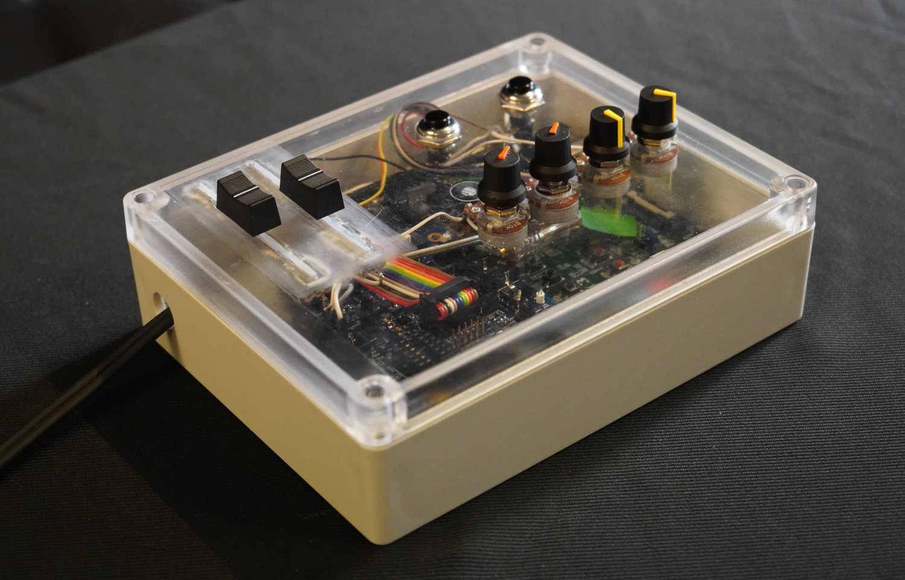

# FAST FPGA Audio Processor Prototype   

<center>
<iframe width="800" height="450" src="https://www.youtube.com/embed/acMhZe8V2ls" title="YouTube video player" frameborder="0" allow="accelerometer; autoplay; clipboard-write; encrypted-media; gyroscope; picture-in-picture" allowfullscreen></iframe>
</center>

The FAST FPGA audio processor is currently being developed as part of the FAST project. It provides a round-trip audio latency inferior to 80us. It also hosts an Analog to Digital Converter (ADC) for sensors offering a "control-to-sound" latency inferior to 100us.

It is based on a [Digilent Zybo Z7 board](https://reference.digilentinc.com/programmable-logic/zybo/start) hosting a Xilinx Zynq 7000 FPGA that is used for audio processing. The FAST FPGA audio processor is fully programmable with the [Faust programming language](https://faust.grame.fr) at high level through USB.

For reference, here's the Faust program used in the above demo video:

```
import("stdfaust.lib");
oscFreq = hslider("oscFreq",80,50,5000,0.01);
lfoFreq = hslider("lfoFreq",1,0.01,50,0.01);
lfoRange = hslider("lfoRange",1000,10,5000,0.01);
oscGain = hslider("oscGain",0.5,0,1,0.01);
noiseGain = hslider("noiseGain",0,0,1,0.01);
LFO = os.lf_triangle(lfoFreq)*0.5 + 0.5;
process = os.sawtooth(oscFreq)*oscGain + no.noise*noiseGain : fi.resonlp(LFO*lfoRange+50,5,1);
```

(you can try it in your browser by pasting in the [Faust Web IDE](https://faustide.grame.fr)).

Next steps involve: 

* improving the performances of the system to run large Faust programs,
* adding more audio inputs and outputs (we're currently aiming at 32x32),
* use this system for active control.


